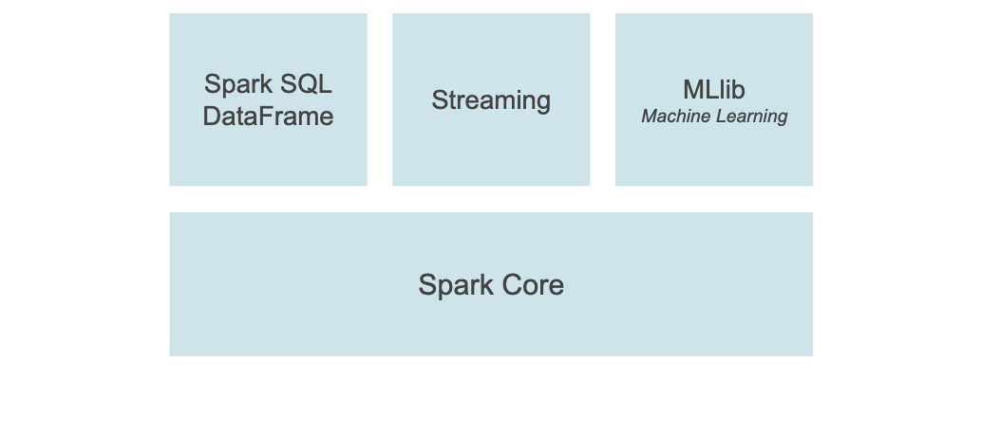

## Pyspark_tutorial

PySpark is an interface for Apache Spark in Python. It not only allows you to write Spark applications using Python APIs, but also provides the PySpark shell for interactively analyzing your data in a distributed environment. PySpark supports most of Spark’s features such as Spark SQL, DataFrame, Streaming, MLlib (Machine Learning) and Spark Core.

### Spark SQL and DataFrame
Spark SQL is a Spark module for structured data processing, in addition it provides programming abstraction called DataFrame
PySpark DataFrame From an Existing RDD
PySpark DataFrame From an External File

### MLlib

### Streaming 
the streaming feature in Apache Spark enables powerful interactive and analytical applications across both streaming and historical data.

### Spark Core
Spark Core is the underlying general execution engine for the Spark platform that all other functionality is built on top of. 